<div align="center">




<br/>

<a href="https://github.com/cristiandromo">
  
</a>

<!-- EDITA AQUI: tus redes sociales -->
<p>
  <a href="https://linkedin.com/in/cristian-romo-980300262" target="_blank">
    
  </a>
  <a href="mailto:cristianromo07@gmail.com">
    
  </a>
  <a href="https://github.com/cristiandromo?tab=repositories" target="_blank">
    
  </a>
  <a href="https://x.com/tu-usuario" target="_blank">
    
  </a>
    </p>
</div>

<!-- Brasas flotando -->


<!-- Terminal animada -->
<div align="center">
  
</div>


<!-- Divisor Respiración de Agua -->


## Sobre mí

<table>
<tr>
<td width="55%" valign="top">

```typescript
const cristian: Developer = {
  rol: "Full Stack Developer",
  ubicacion: "Medellin - Remoto / Abierto a relocalización",
  enfoque: ["APIs escalables", "Arquitectura limpia"],
  stack: {
    frontend: ["React", "TypeScript", "Next.js", "Tailwind"],
    backend: ["Node.js", "Python", "Java", "Spring Boot"],
    data: ["PostgreSQL", "MySQL", "MongoDB"],
    devops: ["Docker", "AWS", "CI/CD", "Git"]
  },
  aprendiendo: ["Microservicios", "Cloud Native", "Kubernetes"],
  disponible: true,
  idiomas: ["Español", "Inglés"]
};
```

</td>
<td width="45%" valign="top" align="center">


<!-- Segunda linea animada (typing) -->


**Datos rápidos**

- Trabajando en: `Open projects`
- Aprendiendo: **Kubernetes y Cloud Native**
- Pregúntame sobre: `React`, `Node`, `APIs`, `Bases de datos`
- Idiomas: **Español / Inglés**

</td>
</tr>
</table>


## Stack y tecnologías

<div align="center">


<br/>

<!-- Marquesina animada propia: edita el texto en assets/marquee.svg -->


<br/>


</div>

## Estadísticas de GitHub

<div align="center">


<br/>


<br/>


</div>


## Trofeos

<div align="center">

<!-- TROFEOS: el dominio oficial esta saturado, se usa un mirror de la comunidad.
     Alternativas / auto-hospedaje: https://github.com/ryo-ma/github-profile-trophy
     Otros mirrors: https://trophygithubreadmelang.cybee.dpdns.org -->


</div>


<!-- [SNAKE] Serpiente de contribuciones (ya activa, rama "output").
     Workflow: .github/workflows/snake.yml
     . -->
## Contribuciones

<div align="center">
  <picture>
    <source media="(prefers-color-scheme: dark)" srcset="https://raw.githubusercontent.com/cristiandromo/cristiandromo/output/github-contribution-grid-snake-dark.svg" />
    <source media="(prefers-color-scheme: light)" srcset="https://raw.githubusercontent.com/cristiandromo/cristiandromo/output/github-contribution-grid-snake.svg" />
    
  </picture>
</div>


<!-- EDITA AQUI: reemplaza "proyecto-1" ... por los nombres reales de tus repos
     (solo el nombre, sin tu usuario). Duplica o borra bloques <a> segun quieras. -->


## Frase del día

<div align="center">

</div>


<!-- Brasas + cierre -->


<div align="center">
  <strong>Gracias por pasar</strong>
</div>


