<!--
  ============================================================================
  README DE PERFIL GITHUB - Cristian Dromo
  Estilo: Pokemon + Respiracion Solar (EE1515 / FFCB05 / 3B4CCA sobre 0D1117)
  ----------------------------------------------------------------------------
  CONFIGURACION RAPIDA
  1) Busca los bloques "EDITA AQUI" y cambia tus datos reales (portafolio, X,
     proyectos, etc.).
  2) Animaciones propias en /assets: pikachu.svg, pokeball.svg, sun.svg,
     divider.svg y marquee.svg. Se usan con rutas relativas, ya funcionan.
  3) La serpiente de contribuciones ya esta activa (rama "output"). Su workflow
     vive en .github/workflows/snake.yml.
  4) Trofeos y grafico de actividad usan servidores publicos gratuitos. Si se
     caen, en sus comentarios hay mirrors y como auto-hospedarlos.
  ============================================================================
-->

<div align="center">




<br/>

<a href="https://github.com/cristiandromo">
  
</a>

<!-- EDITA AQUI: tus redes sociales -->
<p>
  <a href="https://linkedin.com/in/cristian-romo-980300262" target="_blank">
    
  </a>
  <a href="mailto:cristianromo07@gmail.com">
    
  </a>
  <a href="https://tu-portafolio.com" target="_blank">
    
  </a>
  <a href="https://x.com/tu-usuario" target="_blank">
    
  </a>
</p>


</div>

<!-- Divisor animado propio -->


## Sobre mí

<table>
<tr>
<td width="55%" valign="top">

```typescript
const cristian: Developer = {
  rol: "Full Stack Developer",
  ubicacion: "Remoto / Abierto a relocalización",
  enfoque: ["APIs escalables", "Arquitectura limpia", "UI/UX de alto impacto"],
  stack: {
    frontend: ["React", "TypeScript", "Next.js", "Tailwind"],
    backend: ["Node.js", "Python", "Java", "Spring Boot"],
    data: ["PostgreSQL", "MySQL", "MongoDB"],
    devops: ["Docker", "AWS", "CI/CD", "Git"]
  },
  aprendiendo: ["Microservicios", "Cloud Native", "Kubernetes"],
  disponible: true,
  idiomas: ["Español", "Inglés"]
};
```

</td>
<td width="45%" valign="top">

> Convierto ideas en productos funcionales: código mantenible, buenas prácticas
> y experiencias memorables.
>
> Me mueve resolver problemas complejos con soluciones simples y escalables.

<!-- Segunda linea animada (typing) -->


**Datos rápidos**

- Trabajando en: `proyecto-secreto` <!-- EDITA: tu proyecto actual -->
- Aprendiendo: **Kubernetes y Cloud Native**
- Pregúntame sobre: `React`, `Node`, `APIs`, `Bases de datos`
- Idiomas: **Español / Inglés**

</td>
</tr>
</table>


## Stack y tecnologías

<div align="center">

<!-- EDITA: agrega o quita iconos según https://skillicons.dev -->


<br/>

<!-- Marquesina animada propia: edita el texto en assets/marquee.svg -->


<br/>

<!-- EDITA: ajusta los bloques a tu nivel real -->
| Área | Nivel |
| :--- | :--- |
| Frontend | `################....` 80% |
| Backend | `##################..` 90% |
| Bases de datos | `###############.....` 75% |
| DevOps / Cloud | `############........` 60% |

</div>


## Estadísticas de GitHub

<div align="center">


<br/>


<br/>

<!-- GRAFICO DE ACTIVIDAD: servidor publico alternativo (el oficial esta saturado).
     Si se cae, cambia el dominio por un mirror de la comunidad o auto-hospedalo
     gratis en Vercel (1 clic): https://github.com/Ashutosh00710/github-readme-activity-graph -->


</div>


## Trofeos

<div align="center">

<!-- TROFEOS: el dominio oficial esta saturado, se usa un mirror de la comunidad.
     Alternativas / auto-hospedaje: https://github.com/ryo-ma/github-profile-trophy
     Otros mirrors: https://trophygithubreadmelang.cybee.dpdns.org -->


</div>


<!-- [SNAKE] Serpiente de contribuciones (ya activa, rama "output").
     Workflow: .github/workflows/snake.yml
     Si no la quieres, borra este bloque completo. -->
## Contribuciones

<div align="center">
  <picture>
    <source media="(prefers-color-scheme: dark)" srcset="https://raw.githubusercontent.com/cristiandromo/cristiandromo/output/github-contribution-grid-snake-dark.svg" />
    <source media="(prefers-color-scheme: light)" srcset="https://raw.githubusercontent.com/cristiandromo/cristiandromo/output/github-contribution-grid-snake.svg" />
    
  </picture>
</div>


<!-- EDITA AQUI: reemplaza "proyecto-1" ... por los nombres reales de tus repos
     (solo el nombre, sin tu usuario). Duplica o borra bloques <a> segun quieras. -->
## Proyectos destacados

<div align="center">



<br/>

<a href="https://github.com/cristiandromo/proyecto-1">
  
</a>
<a href="https://github.com/cristiandromo/proyecto-2">
  
</a>
<a href="https://github.com/cristiandromo/proyecto-3">
  
</a>
<a href="https://github.com/cristiandromo/proyecto-4">
  
</a>

</div>


## Frase del día

<div align="center">

</div>


<!-- EDITA AQUI: tus enlaces definitivos de contacto -->
## Conecta conmigo

<div align="center">


<br/>

*Décima forma: Respiración Solar, Hinokami Kagura. Modo enfoque activado.*

<br/>

<a href="https://linkedin.com/in/cristian-romo-980300262" target="_blank">
  
</a>
<a href="mailto:cristianromo07@gmail.com">
  
</a>
<a href="https://tu-portafolio.com" target="_blank">
  
</a>
<a href="https://wa.me/+573195707508">
  
</a>

<br/><br/>

> Si algún proyecto te sirvió, déjame una estrella. Se agradece.

</div>


